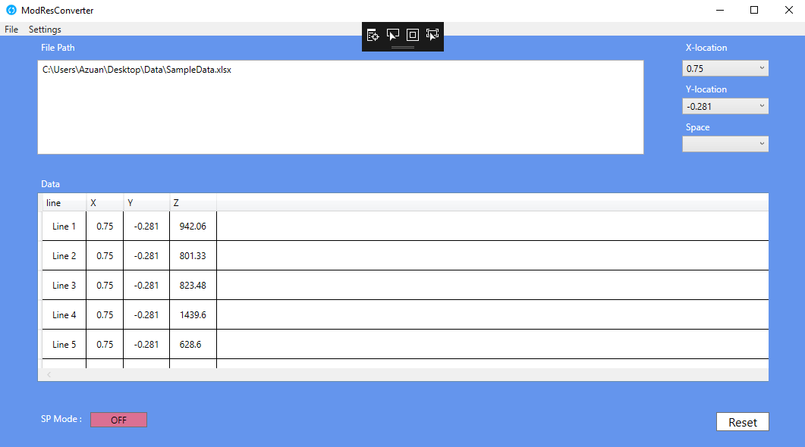

# ModResConverter
> C# Application For Seismic Data Converter

[![NPM Version][npm-image]][npm-url]
[![Build Status][travis-image]][travis-url]
[![Downloads Stats][npm-downloads]][npm-url]

Project develop for School Of Physics, Universiti Sains Malaysia. Application is using C# language as primary language. The purpose of this application is to convert seismic data to meaningful data.



## Installation

Windows:

```sh
1. Copy the code into Visual Studio 2017.
2. Run the application.
```

## Usage example

A few motivating and useful examples of how your product can be used. Spice this up with code blocks and potentially more screenshots.

_For more examples and usage, please refer to the [Wiki][wiki]._

## Release History

* 0.2.0
    * New enchancement
* 0.1.1
    * FIX: Fix small bugs
* 0.1.0
    * First workable program
* 0.0.1
    * Work in progress

## Meta

Azuan Alias – [@azuan_tra](https://twitter.com/azuan_tra) – azuanalias92@gmail.com

Distributed under the GPL 3.0 license. See ``LICENSE`` for more information.

https://opensource.org/licenses/GPL-3.0

<!-- Markdown link & img dfn's -->
[npm-image]: https://img.shields.io/npm/v/datadog-metrics.svg?style=flat-square
[npm-url]: https://npmjs.org/package/datadog-metrics
[npm-downloads]: https://img.shields.io/npm/dm/datadog-metrics.svg?style=flat-square
[travis-image]: https://img.shields.io/travis/dbader/node-datadog-metrics/master.svg?style=flat-square
[travis-url]: https://travis-ci.org/dbader/node-datadog-metrics
[wiki]: https://github.com/yourname/yourproject/wiki
